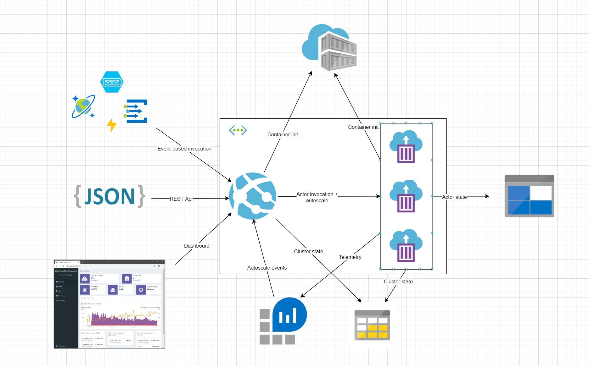

# Serverless Orleans

The goal of this project is to demonstrate a pragmatic approach to developing and hosting an actor-based application using ASP.NET Core, Azure App Service + WebJobs, Container Instances, and Orleans.

The codebase is separated into two parts:

- [/base](./base) contains the core frontend and backend implementation, but no application-specific code. The Docker containers created from this code can be re-used across multiple solution stacks.

- [/app](./app) contains a simple example app built upon the foundation code in [/base](./base). Specifically it contains an actor implementation and ASP.NET Core controller and webjob listener code that invokes the actor.

At runtime, the application-specific code is injected into the runtime host processes using [dynamic assembly loading](https://docs.microsoft.com/en-us/dotnet/api/system.reflection.assembly.loadfrom?view=netcore-3.1). This eliminates the need for static .NET dependencies and allows solution-specific code to be developed and tested independently from the core runtime.

## Design Goals

- [API](./app/message_app/MessagesController.cs)- and [event-based](./app/message_app/MessagesListener.cs) abstractions between actors and the external world (no direct access to actors)
- logical and physical separation between [actor host](./base/backend) and [actor abstractions](./base/frontend)... allow each to be configured and scale independently
- logical separation between [infrastructure code](./base) and [solution code](./app)... maximize app developer productivity by hiding infra details as much as possible
- allow all infrastructure knobs to be twisted, if/when desired (ACI or Orleans config, etc.)
- [run and debug](./docker-compose.yml) the full solution stack on your laptop (no Azure needed)
- [single command build and deploy](./deploy.tf) of the full solution stack to Azure, using lightweight PaaS services where possible

## Why Azure Container Instances (and why not AKS)?

A major drawback of most actor-based systems is the need to manage infrastructure. [Durable Entities](https://docs.microsoft.com/en-us/azure/azure-functions/durable/durable-functions-entities?tabs=csharp) solves this problem by layering an actor implementation on top of serverless Azure Functions; however, the DE actor implementation is rudimentary compared to other options and there are relatively few "knobs to twist" to optimize performance/scale for specific scenarios.

[Azure Container Instances](https://docs.microsoft.com/en-us/azure/container-instances/) provide a simple mechanism to run containers in Azure, without the overhead and management burden of a full-blown Kubernetes orchestrator underneath. You can configure VM size, vnet integration, etc. for running containers.

One drawback of ACI is the lack of an autoscale mechanism (something AKS does well). This project addresses this by hooking [alerts surfaced from Azure Monitor metrics](https://docs.microsoft.com/en-us/azure/azure-monitor/platform/alerts-metric). Alert rules are defined for CPU min/max thresholds, as well as webhook-based actions that execute when rule conditions are met; the webhook implementations add or remove ACI instances as needed to ensure adequate resources for in-flight, actor-based workloads.

[Azure Kubernetes Service](https://docs.microsoft.com/en-us/azure/aks/) is a great option for hosting elastically scaled infrastructure like actors. However, there are project and organizational contexts in which AKS and Kubernetes more generally represent a significant ongoing management burden; this project is an attempt to explore other options. That said, AKS + a [bit](https://docs.microsoft.com/en-us/azure/aks/cluster-autoscaler) of [config](https://docs.microsoft.com/en-us/azure/aks/tutorial-kubernetes-scale#autoscale-pods) would make a good host for the backend actor infrastructure of this project, at minimum.

## Why Azure App Service + WebJobs (and why not Azure Functions)?

In actor-based systems, actor instances typically interact with the outside world in one of two ways:

- external processes invoke an API which uses actor invocations as part of its implementation, demonstrated [here](./app/message_app/MessagesController.cs)
- a listener process subscribes to external events and invokes actors upon event arrival, demonstrated [here](./app/message_app/MessagesListener.cs)

Azure Functions have built-in support for [event-based triggers](https://docs.microsoft.com/en-us/azure/azure-functions/functions-triggers-bindings), and are an obvious choice to model the second pattern above. The issue with Functions is that they (by design) provide limited ability to configure the underlying host, which interferes with the ability to inject startup and configuration needed for efficient communication with Orleans clusters.

An alternative is to [use the WebJobs runtime and SDK](https://docs.microsoft.com/en-us/azure/app-service/webjobs-sdk-how-to) directly. Functions are built on top of WebJobs; the trigger mechanisms in Functions are defined in terms of WebJobs primitives and can be used from WebJobs code. In addition, WebJobs allow full configuration of the host process and are therefore a good fit here.

## Why actors?

https://www.brianstorti.com/the-actor-model/

## Why Orleans?

There are many available actor implementations:

- [Akka](https://akka.io/) and [Akka.NET](https://getakka.net/)
- [Service Fabric actors](https://docs.microsoft.com/en-us/azure/service-fabric/service-fabric-reliable-actors-introduction)
- [Dapr actors](https://github.com/dapr/docs/tree/master/concepts/actors#actors-in-dapr)
- languages like [Scala and Erlang](https://medium.com/@emqtt/erlang-vs-scala-5b5190326ef5)

[Orleans](https://dotnet.github.io/orleans/Documentation/index.html) is a .NET-based implementation of the [virtual actor pattern](https://www.microsoft.com/en-us/research/publication/orleans-distributed-virtual-actors-for-programmability-and-scalability/). It began as an incubation project in Microsoft Research, and has been [developed](https://github.com/dotnet/orleans), deployed, and continuously improved for over 10 years. It serves as the [foundation](https://dotnet.github.io/orleans/Community/Who-Is-Using-Orleans.html) for a number of high-scale cloud architectures both within and outside Microsoft.

In addition, Orleans has:

- a full .NET Core implementation
- a vibrant, community-oriented extensibility [ecosystem](https://github.com/OrleansContrib)
- full integration with [ASP.NET Core and generic .NET Core hosts](https://dotnet.github.io/orleans/Documentation/clusters_and_clients/configuration_guide/server_configuration.html)
- support for [journaling and event sourcing](https://dotnet.github.io/orleans/Documentation/grains/event_sourcing/index.html)

More info on Orleans [here](https://dotnet.github.io/orleans/Documentation/resources/links.html)

## Prerequisites

- [Docker](https://docs.docker.com/get-docker/) (use [this](https://docs.docker.com/docker-for-windows/wsl-tech-preview/) if you run WSL2 on Windows)
- [Visual Studio Code](https://code.visualstudio.com/download)
- [VS Code Docker extension](https://marketplace.visualstudio.com/items?itemName=ms-azuretools.vscode-docker)
- [VS Code C# extension](https://marketplace.visualstudio.com/items?itemName=ms-dotnettools.csharp)
- [.NET Core 3.x SDK](https://dotnet.microsoft.com/download)
- [Azure Storage Explorer](https://azure.microsoft.com/en-us/features/storage-explorer/)
- [Postman](https://www.postman.com/)
- [Terraform](https://learn.hashicorp.com/terraform/getting-started/install.html)

## Local dev and debugging

- Run [create-service-principal.sh](./create-service-principal.sh) to generate an [Azure SP](https://docs.microsoft.com/en-us/azure/active-directory/develop/app-objects-and-service-principals) used to add/remove ACI instances during autoscale events
- Run [build-base-images.sh](./build-base-images.sh) to create the base Docker images for solution frontend (API, event listeners, and dashboards) and backend (actor host)
- Right-click [docker-compose.yml](./docker-compose.yml) and select 'Compose Up'. This will build and launch the containers defined in the YAML file
- Set breakpoints as desired
- Launch the VS Code debugger with F5. VS Code will attach to the 'frontend' container with a remote debugger session
- Using Storage Explorer, connect to Azurite emulated storage. Create a new queue called 'input' and add a message to it with a simple text body ('hello world' or similar)
- Using Postman or curl, send an HTTP GET request to http://localhost:5000/messages
- When finished, right-click [docker-compose.yml](./docker-compose.yml) and select 'Compose Down'

## Azure deployment

- [Log into the Azure CLI](https://docs.microsoft.com/en-us/cli/azure/authenticate-azure-cli?view=azure-cli-latest)
- Initialize and run terraform to create the Azure resources defined in [deploy.tf](./deploy.tf):

 <pre>
    terraform init
    terraform apply
</pre>

## Future plans

- [Event-sourced](https://dotnet.github.io/orleans/Documentation/grains/event_sourcing/index.html) actor state
- Scalability and load testing (multiple ACI nodes, etc.)
- Node.js and/or Python interop (define actor logic in Node or Python, with a common .NET foundation)
